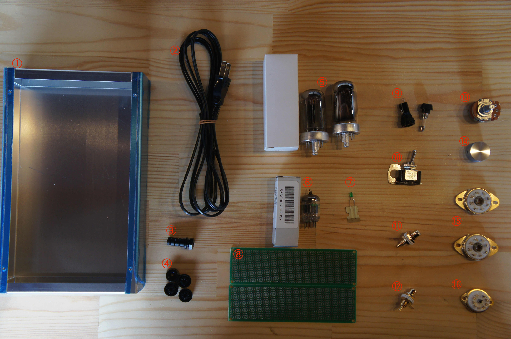
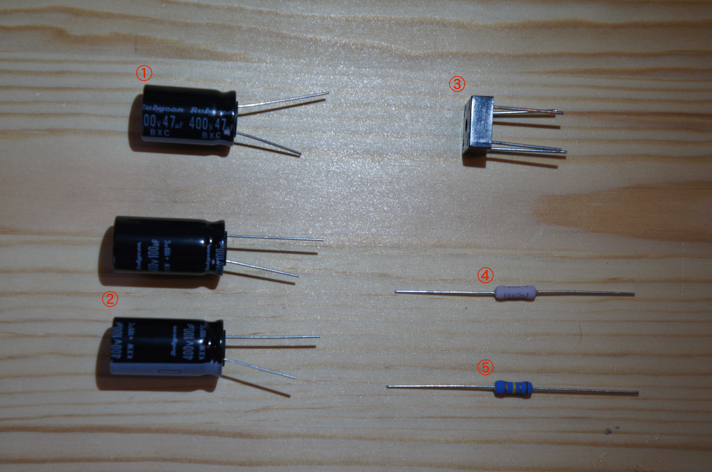
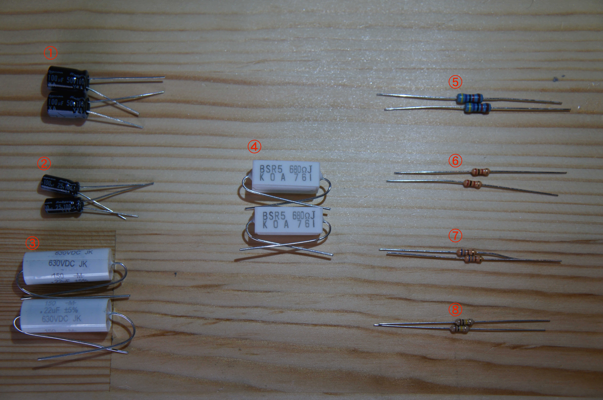
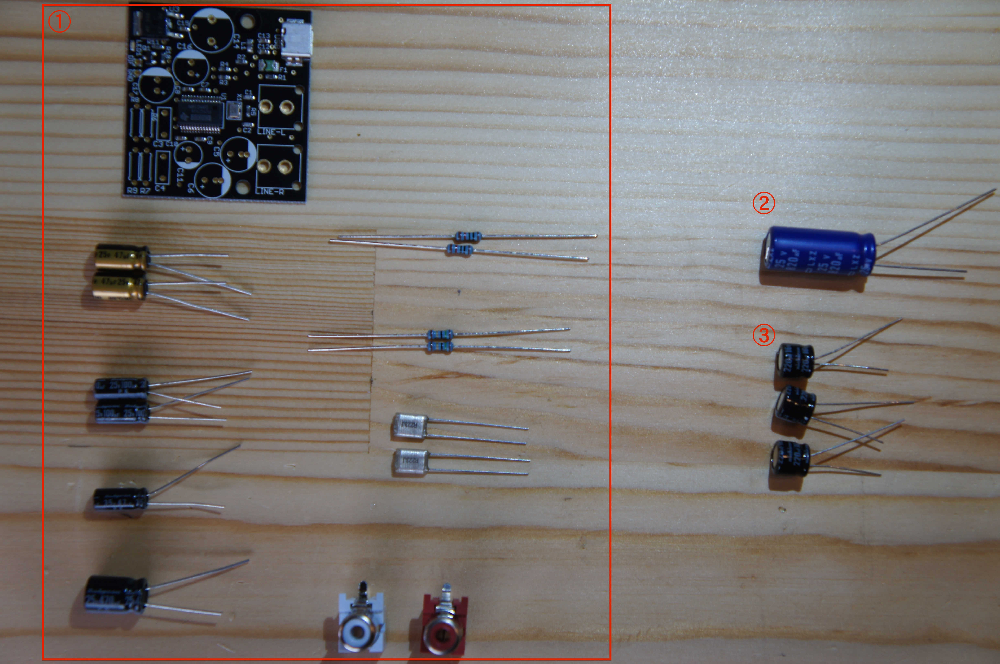

# First Chapter

101.真空管アンプ 部品一覧
部品一覧

⑴ケース関連
 

|①アルミケース|②電源コード |③コードブッシュ 	|④プラ足  × 4|
|--|--|--|--|
|⑤出力管(4P1L) × 2|⑥ドライバー管|⑦LED 	|⑧ユニバーサルボード × 2 |
|⑨ヒューズ、ヒューズケース|⑩ トグルスイッチ	|⑪ RCAジャック（赤）|⑫RCAジャック（白）| 
|⑬ボリューム|⑭ボリュームツマミ |⑮8Pinロクタル管ソケット × 2 |⑯ MT9ソケット

⑵電源基板関連
 

|①電解コンデンサ400V47μF|②電解コンデンサ400V100μF	|③ブリッジダイオード| 
| -- | -- | -- |
|④酸化金属抵抗 2W 18KΩ	|⑤酸化金属抵抗 2W 180KΩ	 ||

⑶ドライバー基板関連
 

|①電解コンデンサ50V100μF × 2|②電解コンデンサ25V100μF × 2	|③フィルムコンデンサ Mallory 630V 0.22μF × 2|	
|--|--|--|
|④セメント抵抗5W680Ω × 2|⑤金属皮膜抵抗1/2W47kΩ × 2	|⑥抵抗　2kΩ × 2	|
|⑦抵抗　680Ω × 2|⑧抵抗　100kΩ × 2|

⑷DCコンバータ関連
 

 |①DCコンバーターキット	|②電解コンデンサ820μF	 |③電解コンデンサ 220μF ×3|
 |-|
