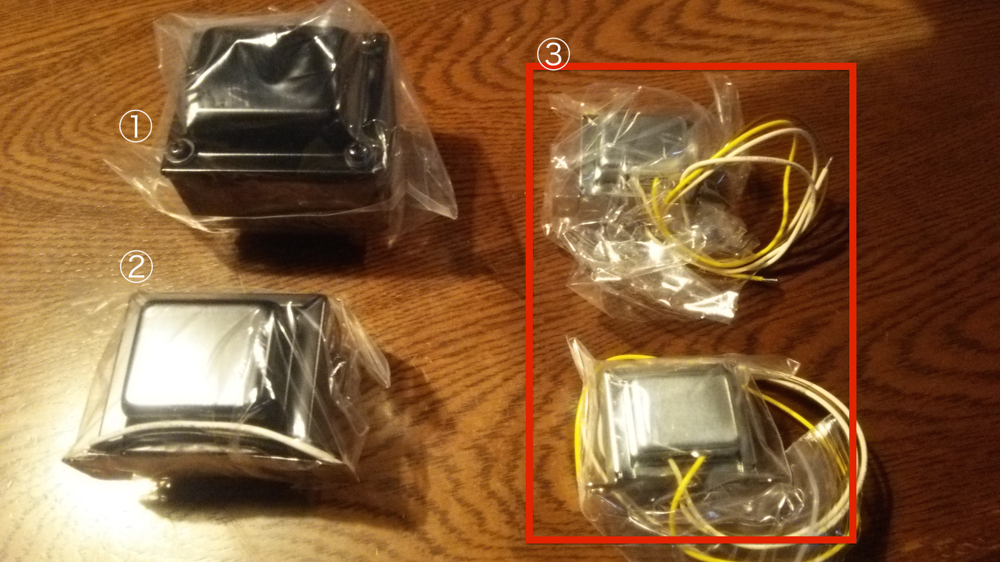

# 1.真空管アンプ 部品一覧

#### ⑴ケース関連１

①アルミケース　　　　　　　　②電源コード 
 
③コードブッシュ　　　　　　　④プラ足  × ４
 
⑤出力管(4P1L) × ２　　　　　　⑥ドライバー管
 
⑦ＬＥＤ　　　　　　　　　　　⑧ユニバーサルボード × 2
 
⑨ヒューズ、ヒューズケース　　⑩ トグルスイッチ
 
⑪ RCAジャック（赤）　　　　　⑫RCAジャック（白）
 
⑬ボリューム　　　　　　　　　⑭ボリュームツマミ 
 
⑮8Pinロクタル管ソケット × 2 　⑯ MT9ソケット

 

#### ⑵ケース関連２

 
①電源トランス
 
②チョークコイル
 
③電源トランス × 2

 

#### ⑶電源基板関連

①電解コンデンサ400V47μF
 
②電解コンデンサ400V100μF
 
③ブリッジダイオード 
 
④酸化金属抵抗 2W 18KΩ
 
⑤酸化金属抵抗 2W 180KΩ

 
#### ⑷ドライバー基板関連

①電解コンデンサ50V100μF × 2
 
②電解コンデンサ25V100μF × 2
 
③フィルムコンデンサ Mallory 630V 0.22μF × 2
 
④セメント抵抗5W680Ω × 2
 
⑤金属皮膜抵抗1/2W47kΩ × 2
 
⑥抵抗　2kΩ × 2
 
⑦抵抗　680Ω × 2
 
⑧抵抗　100kΩ × 2

 
#### ⑸DCコンバータ関連

①DCコンバーターキット
 
②電解コンデンサ820μF
 
③電解コンデンサ 220μF ×3