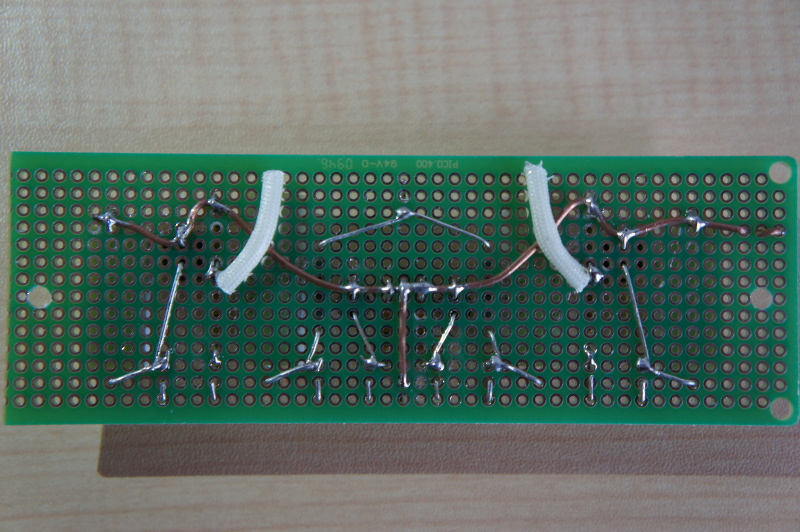

# 基板作成

### ユニバーサルボードをカット

はんだ付けを行う前に、ユニバーサルボードを電源基板用、ドライバー基板用にそれぞれカットします。

【電源基板】
 

【ドライバー基板】
 

#### はんだ付け
【電源基板】表面
 

 
【電源基板】裏面
 

 
【電源基板】配線図
 

※大きい◯で書かれている場所はネジを通す穴になるので、ドリルで穴を開けます。

 
【ドライバー基板】表面
 

 
【ドライバー基板】裏面
 

【ドライバー基板】配線図
 

 
#### 回路図

