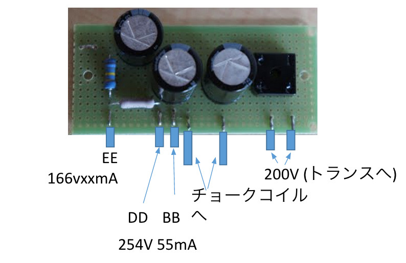
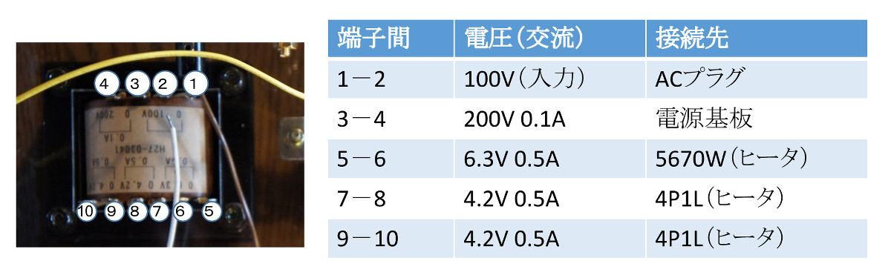
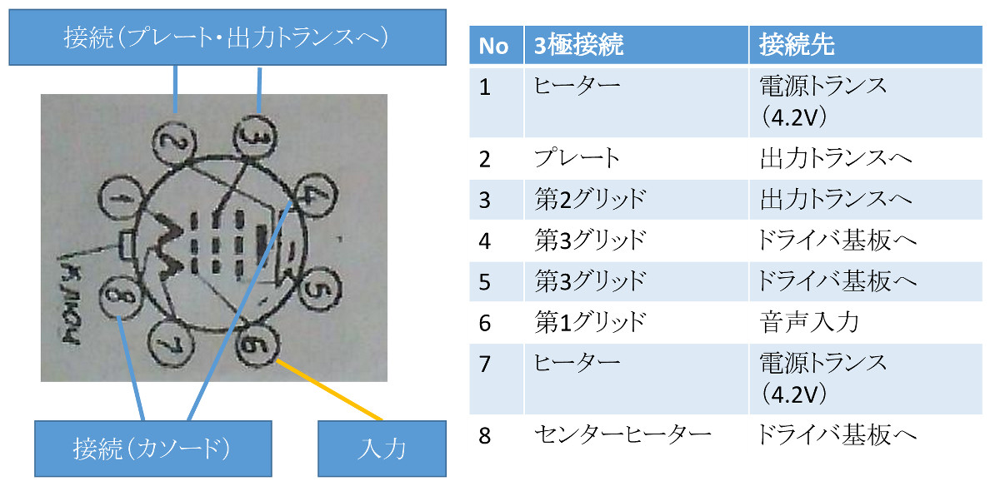
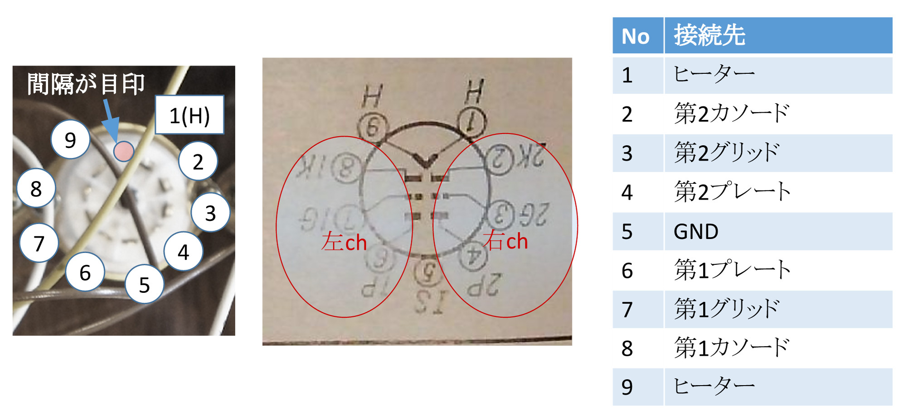
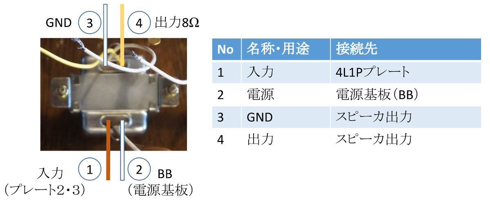
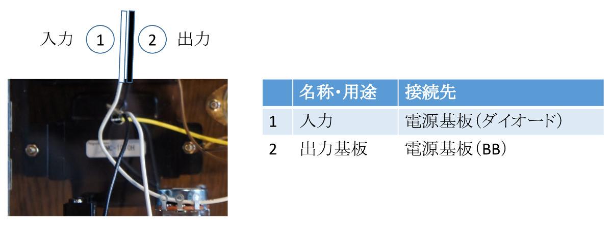
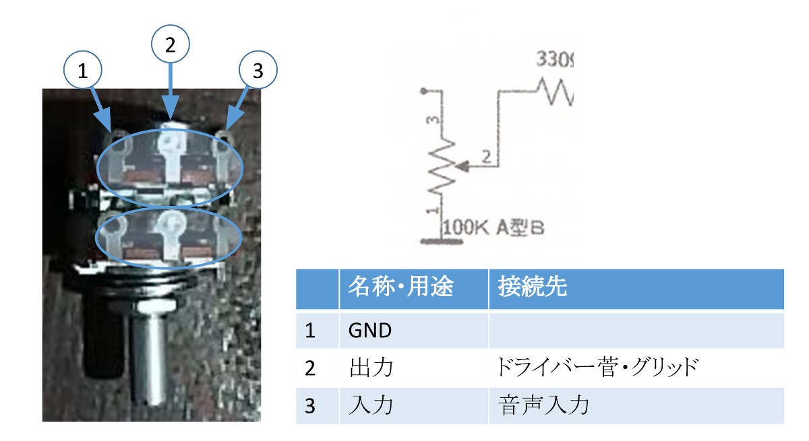
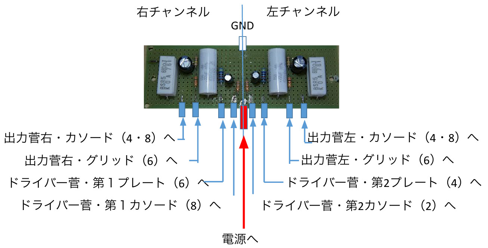
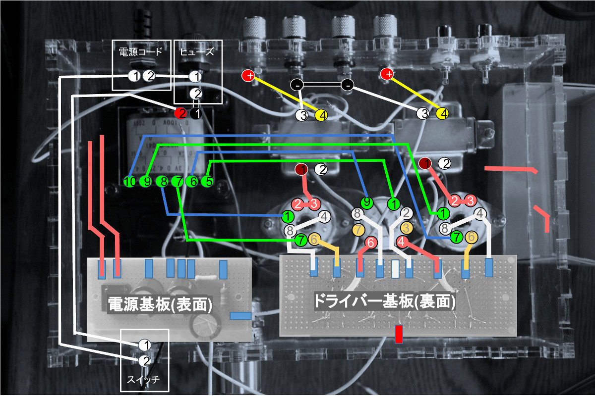

# 配線

## 電源基板
真空管を動作させるための電源を作る基板

 

## 電源トランス

 

## 出力菅(4P1L)

 

## 3極接続（左右独立）

 

## ドライバー菅（5670W・左右共通）
相3極管
2つの信号を独立して増幅することができる。
 
この菅に右、左チャンネルの入力を接続する。
 

 

## 出力トランス（左右独立）

 

## チョークコイル

①と②は、それぞれ電源基板のダイオード、BBに接続するが、どちらに接続してもよい。

 
リップルを取り除いて、整流する。

 

## 2連ボリューム（左右）

 

## ドライバー基板

## 全体図

全体図作成中
 

* カソード：白
* プレート：赤
* グリッド：黄
* グランド：黒
* ＋：赤

