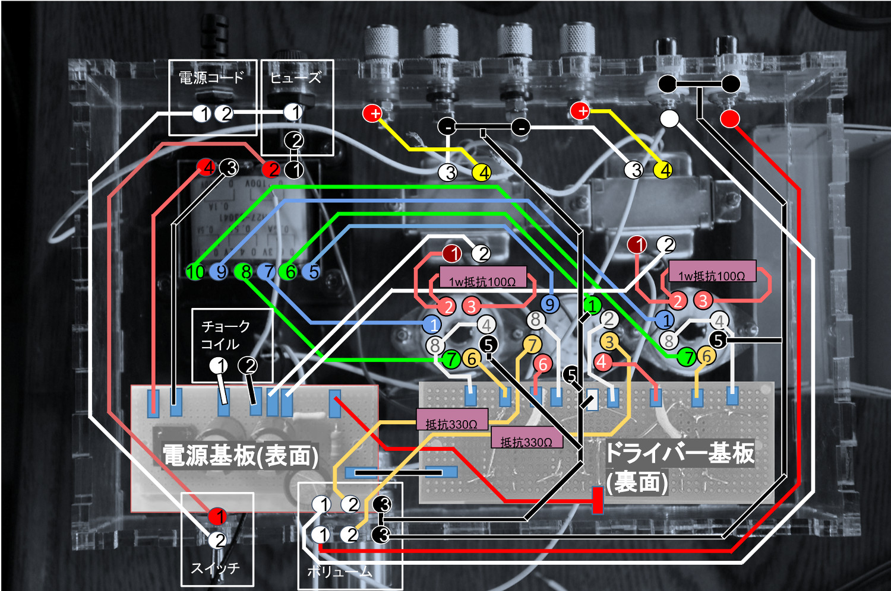

# 配線

## 電源基板
真空管を動作させるための電源を作る基板

## ドライバー基板

 

## 電源トランス

 

## 出力管(4P1L)

#### 3極接続（左右独立）

 

## ドライバー管（5670W・左右共通）
相3極管
2つの信号を独立して増幅することができる。
 
この管に右、左チャンネルの入力を接続する。
 

 

## 出力トランス（左右独立）

 

## チョークコイル

リップルを取り除いて、整流する。

①と②は、それぞれ電源基板のダイオード、BBに接続するが、どちらに接続してもよい。

 

## 2連ボリューム（左右）

 

## 配線図（全体）

 

* カソード：白
* プレート：赤
* グリッド：橙
* GND：黒
* ＋：赤

